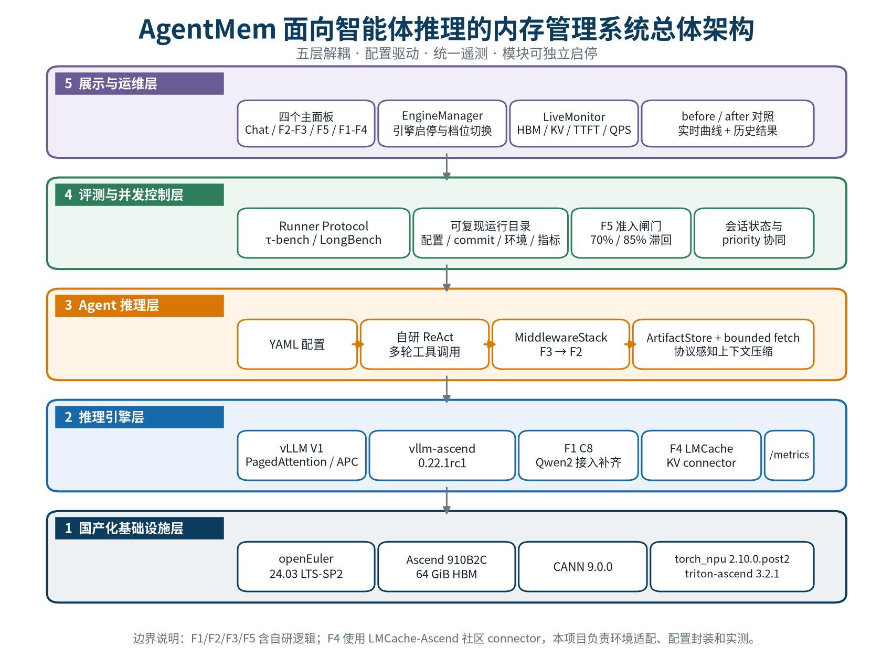

# AgentMem-Ascend：面向智能体推理的内存管理优化系统

本项目面向操作系统开源创新大赛赛题 14，针对 LLM Agent 在长生命周期、多轮工具调用和多会话并发场景中的 KV Cache 膨胀、上下文冗余、工具结果挤占上下文以及抢占重算问题，构建了一套运行在 **openEuler + Ascend 910B2C + vLLM-Ascend** 上的内存管理优化系统。

系统不修改 vLLM 内核，通过配置驱动的引擎参数、KV connector、上下文中间件和 session 生命周期策略接入五项能力，并提供统一 Benchmark、运行元数据归档和 Gradio 实时演示界面。



## 核心功能

| 模块 | 解决的问题 | 主要实现 | 对应配置 |
|---|---|---|---|
| F1 C8 int8 KV 量化 | BF16 KV 占用高、并发容量低 | post-RoPE 自校准、Qwen2 C8 注入、Ascend 量化启动参数 | `f1-bench-c8.yaml` |
| F2 上下文压缩 | 多轮历史与固定提示重复进入上下文 | LLMLingua-2、冷热分层、增量复用、工具协议字段保护 | `f2-compress.yaml` |
| F3 工具数据外置 | 大型 JSON/HTML/CSV 工具结果挤占 KV | SQLite/内存 ArtifactStore、确定性摘要、有界按需检索 | `f3-lazyload.yaml` |
| F4 KV 分层存储 | HBM 容量限制冷 KV 留存 | `LMCacheAscendConnector`，NPU/CPU/Disk 分层 | `f4-lmcache.yaml` |
| F5 会话感知调度 | 多会话并发导致 KV 池溢出和抢占重算 | KV-pool 水位感知、滞回准入、并发 session 驱动 | `f5-evict-dynamic.yaml` |

项目还保留 LATS/MCTS 多路径决策实验，用于研究分支推理中的前缀复用与内存行为。

## 已归档实验结果

下表只列出已有报告中的观测值。不同模块的 workload、运行次数和统计口径不同，不能直接横向比较；完整边界条件见对应报告。

| 模块 | 主要观测 | 报告 |
|---|---|---|
| F1 | 同 HBM 预算下 KV token 容量 `775,936 -> 1,556,992`，即 `2.007x` | [F1 Benchmark](docs/F1-benchmark-results.md) |
| F2 | tau-bench 115 任务同轨迹配对 Prompt 减少 `19.38%`，115 个结果无 transport/runtime 错误 | [F2 115-task 结果](docs/F2-taubench-llmlingua2-115-results-20260729.md) |
| F3 | LongBench first100 累计 Prompt 减少约 `66.7%`，TTFT 中位数下降约 `87%`；最佳观测成功率比重测 baseline 低 3 pp | [F3 first100 结果](docs/F3-longbench-first100-baseline-f3-results-20260730.md) |
| F4 | 当前 workload 下单 Agent p50 下降 `21%`、并发 4 QPS 提升 `32%`；因未触发 offload，HBM 峰值基本持平 | [F4 集成与结果](docs/F4-lmcache-ascend.md) |
| F5 | 已验证烟测中抢占 `2 -> 0`、KV 命中率 `0.797 -> 0.921`、p50 `83 s -> 43 s`；完整多工况重复实验仍需按报告复跑 | [F5 模块说明](docs/F5-module-description.md) |

## 目录结构

```text
.
├── agent-mem/
│   ├── src/agent_mem/       # 核心 Python 包
│   ├── benchmarks/          # 统一 Benchmark CLI 与专项基准
│   ├── configs/             # baseline、F1-F5 与组合配置
│   ├── docker/              # 容器化部署文件
│   └── tests/               # 单元测试与构造测试
├── scripts/                 # 校准、实验编排、分析与文档工具
├── docs/                    # 技术报告、实验结论与架构素材
├── dev-guide/               # 环境搭建和依赖状态
├── models/README.md         # 模型目录约定，权重不入库
├── third_party/             # 第三方版本清单，源码克隆体不入库
└── submission/README.md     # 竞赛交付物占位与上传规则
```

## 环境要求

### 基础开发环境

- Python `>=3.11,<3.13`
- Linux；项目验证环境为 openEuler 24.03
- CPU 环境可运行配置校验、单元测试和 dry-run

### Ascend 真机环境

- Ascend 910B2C，64 GiB HBM
- CANN 9.0.0 及 Ascend 910B 算子包
- PyTorch 2.10.0、torch-npu 2.10.0.post2
- vLLM 0.22.1、vllm-ascend 0.22.1rc1
- Qwen2.5-7B-Instruct 模型权重

完整安装过程、固定版本和已知问题见 [环境搭建指南](dev-guide/environment-setup.md)、[安装状态](dev-guide/install-status.md) 和 [第三方版本清单](third_party/VERSIONS.md)。模型权重不进入 Git，目录约定见 [models/README.md](models/README.md)。

## 快速开始

以下命令均从仓库根目录执行。

### 1. 创建 Python 环境

```bash
python3.11 -m venv .venv
source .venv/bin/activate
python -m pip install --upgrade pip
python -m pip install -e "agent-mem[dev,demo]" qwen-agent
```

运行 tau-bench 真任务前，按版本清单安装第三方依赖：

```bash
git clone https://github.com/sierra-research/tau-bench third_party/tau-bench
python -m pip install -e third_party/tau-bench
```

F2 的 LLMLingua-2 压缩器使用独立环境，F4 和 Ascend 引擎还需要额外原生依赖；请按 `dev-guide/environment-setup.md` 配置，不要把虚拟环境、模型权重或 Hugging Face 缓存提交到仓库。

### 2. CPU 自检

```bash
cd agent-mem
python -m pytest tests -q
python -m ruff check src tests
python benchmarks/runner.py \
  --config configs/prefix_cache.yaml \
  --runner dry-run \
  --runs 1
```

dry-run 只验证配置、运行目录和指标链路，不代表真实性能结果。

### 3. 启动 Ascend 推理引擎

确认 NPU、CANN 和模型权重就绪后：

```bash
source /usr/local/Ascend/ascend-toolkit/set_env.sh
source .venv/bin/activate

python -m agent_mem.server.vllm_server \
  --config agent-mem/configs/prefix_cache.yaml \
  --model-path models/Qwen2.5-7B-Instruct \
  --tool-call-parser hermes \
  --port 8000 \
  --log-file logs/engine.log
```

服务就绪后，OpenAI-compatible API 位于 `http://127.0.0.1:8000/v1`，Prometheus 指标位于 `http://127.0.0.1:8000/metrics`。

F1 C8 运行前必须完成真实 post-RoPE 校准；占位 scale 仅用于链路探针，不能用于结果评测。具体步骤见 [F1 C8 注入说明](docs/F1-c8-injection.md)。

### 4. 启动演示界面

在另一个终端执行：

```bash
source .venv/bin/activate
python -m agent_mem.demo \
  --engine-url http://127.0.0.1:8000/v1 \
  --model Qwen2.5-7B-Instruct \
  --model-path models/Qwen2.5-7B-Instruct \
  --host 0.0.0.0 \
  --port 7860
```

浏览器访问 `http://<服务器地址>:7860`。界面包含普通 Agent 对话、F2/F3 上下文任务、F1/F4 通用 KV 改进、F5 高并发专项和实时监控。若服务器不直接开放端口，可使用 SSH 端口转发。

### 5. 运行真实 Benchmark

```bash
cd agent-mem
python benchmarks/runner.py \
  --config configs/prefix_cache.yaml \
  --runner qwen-agent \
  --engine-url http://127.0.0.1:8000/v1 \
  --device npu \
  --max-tasks 10 \
  --max-steps 20 \
  --max-concurrency 1
```

结果默认写入根目录 `logs/`，每个 run 保存配置副本、Git commit、环境快照、指标和运行日志。需要外部 user simulator 的配置只从其声明的环境变量读取密钥，例如：

```bash
export MIMO_KEY='<your-key>'
```

请勿把密钥写入 YAML、README、日志或提交历史。

## 配置入口

| 使用场景 | 推荐配置 |
|---|---|
| 无优化对照 | `agent-mem/configs/baseline.yaml` |
| vLLM 默认前缀缓存 | `agent-mem/configs/prefix_cache.yaml` |
| F1 C8 对照 | `agent-mem/configs/f1-bench-baseline.yaml` / `f1-bench-c8.yaml` |
| F2/F3 组合 | `agent-mem/configs/f2-f3-combined.yaml` |
| F4 LMCache | `agent-mem/configs/f4-lmcache.yaml` |
| F5 原生/准入对照 | `agent-mem/configs/f5-native.yaml` / `f5-evict-dynamic.yaml` |
| LongBench 上下文任务 | `agent-mem/configs/unified-longbench.yaml` |

## 文档

- [项目说明书 Markdown 源稿](docs/项目说明书.md)
- [技术报告 Markdown 源稿](docs/技术报告.md)
- [F1-F4 技术路线报告](docs/推理引擎层优化方案-F1-F4技术报告.md)
- [F5 多并发章节](docs/F5-chapter-multiconcurrency.md)
- [指标目录与口径](docs/metrics-catalog.md)
- [agent-mem 包说明](agent-mem/README.md)

## 竞赛交付物

本仓库已在 [`submission/README.md`](submission/README.md) 预留设计文档、参赛承诺书、演示 PPT 和演示视频的固定路径。当前代码提交只包含占位清单；上述四项由参赛团队在最终材料确认后单独上传。演示视频必须小于或等于 **100 MB**，建议压缩到 95 MB 以内再提交。

## 安全与仓库边界

- 不提交模型权重、虚拟环境、Hugging Face 缓存、原始运行日志和本机缓存。
- 不提交 API key、访问令牌、账号信息或包含密钥的环境快照。
- 第三方源码克隆体不入库，仓库只保留来源、版本和 commit 清单。
- 所有性能结论必须注明硬件、配置、运行次数和统计口径；不得把 dry-run 或静态演示数据当作真机结果。
